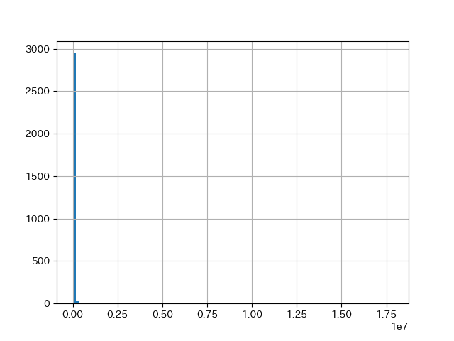
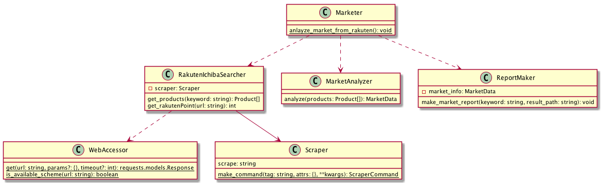

# python-rakuteIchiba-report

個人のpython用学習リポジトリです。

楽天市場で任意検索を行い、簡易的な商品分析レポートを作成します。 
下記は出力サンプルです。

----
<h2>楽天市場商品検索レポート</h2>
<h3>作成日: 2019-03-24  検索キーワード: "腕時計"</h3>
<h2>価格分布</h2>

<h2>高価格Top5</h2>

<table border="1" class="dataframe"> <thead> <tr style="text-align: right;"> <th>title</th> <th>price</th> <th>image</th> <th>point</th> </tr> </thead> <tbody> <tr> <td><a href="https://item.rakuten.co.jp/jackroad/rx735/">ロレックス ROLEX コスモグラフ デイトナ 116576TBR 【新品】 時計 メンズ</a></td> <td>17850000</td> <td></td> <td>178500</td> </tr> <tr> <td><a href="https://item.rakuten.co.jp/brandacross/h-e392/">【24時間限定3%OFF】 ROLEX ロレックス 腕時計 デイトナ 116520 G番 ステンレス 40mm 白文字盤 日本国内正規品 メンズ クロノグラフ コスモグラフ ステンレス ホワイト文字盤 旧型 廃盤品 希少 自動巻き オートマ スポーツモデル</a></td> <td>2160000</td> <td></td> <td>21600</td> </tr> <tr> <td><a href="https://item.rakuten.co.jp/yukizaki/w163079/">【全品 ポイント10倍 3/26まで】ロレックス ROLEX デイトジャスト ベゼルダイヤ 178344 ブロンズローマ（VIダイヤ）文字盤 レディース 腕時計 【新品】</a></td> <td>1252800</td> <td></td> <td>12528</td> </tr> <tr> <td><a href="https://item.rakuten.co.jp/jackroad/iwc275/">IWC IWC ポルトギーゼ オートマティック 7デイズ IW500705 【新品】 時計 メンズ</a></td> <td>1200500</td> <td></td> <td>12005</td> </tr> <tr> <td><a href="https://item.rakuten.co.jp/yukizaki/w157943/">【全品 ポイント10倍 3/26まで】シャネル CHANEL J12 スーパーレッジェーラ クロノグラフ H3410 シルバー文字盤 メンズ 腕時計 【新品】</a></td> <td>1026000</td> <td></td> <td>10260</td> </tr> </tbody></table>

<h2>低価格Top5</h2>

<table border="1" class="dataframe"> <thead> <tr style="text-align: right;"> <th>title</th> <th>price</th> <th>image</th> <th>point</th> </tr> </thead> <tbody> <tr> <td><a href="https://item.rakuten.co.jp/mikomiko/30924821206168/">【非売品/10000円以上ご購入の方限定】ノベルティ　GUOU　ラグジュアリー　女性　腕時計　ファッション　レジャー　レディース　クォーツ　時計　防水　腕時計　女性　アクセ　アクセサリー　※商品説明を必ずご覧下さい</a></td> <td>1</td> <td></td> <td>0</td> </tr> <tr> <td><a href="https://item.rakuten.co.jp/shop-murakami/10008835/">LR927×10個【L926F】再入荷/Vinnicボタン電池・電池・アルカリボタン電池・時計用電池・アルカリ電池 アルカリお得な正規輸入品。お子様の腕時計や玩具などに！395 SR927SW SR927W 互換品</a></td> <td>90</td> <td></td> <td>0</td> </tr> <tr> <td><a href="https://item.rakuten.co.jp/shop-murakami/10008890/">Vinnic SR1130W/SR1130SW×1個【389EF】ボタン電池・電池・アルカリボタン電池・時計用電池・アルカリ電池お得な正規輸入品(LR1130/L1130/SR1130SW/SR1130W/389互換品)お子様の腕時計や玩具などに！</a></td> <td>108</td> <td></td> <td>1</td> </tr> <tr> <td><a href="https://item.rakuten.co.jp/digisto/rev18171/">腕時計スタンド C型 [ 1個 ] ウォッチスタンド ディスプレイ</a></td> <td>130</td> <td></td> <td>1</td> </tr> <tr> <td><a href="https://item.rakuten.co.jp/anshin11/10000686/">腕時計 【ベルト調整器具 】ピン抜き機(予備針付き)</a></td> <td>324</td> <td></td> <td>3</td> </tr> </tbody></table>

--- 

# Usage

## [事前準備]楽天APIキーの取得

- [楽天API](https://webservice.rakuten.co.jp/document/)のアプリIDを発行します。
- `src/worker/rakutenIchibaSeacher.py`内の`RAKUTEN_APPLICATION_ID`に取得したアプリIDを代入します。

## 実行
- 下記コマンドを実行してください 
`$ python setup.py install` 
`$ cd src` 
`$ python rakuten_report.py` 

- 任意の検索キーワードを入力してください。 
処理が完了するとブラウザが起動し、レポートが表示されます。

# Dependency

- python: 3.7.1
- pandas: 0.23.4
- matplotlib: 3.0.2
- Markdowdn: 3.0.1
- beautifulsoup4: 4.6.3
- selenium: 3.141.0  
- requests: 2.21.0
- chromedriver-binary==73.0
- setuptools: 40.6.3

# Architecture
